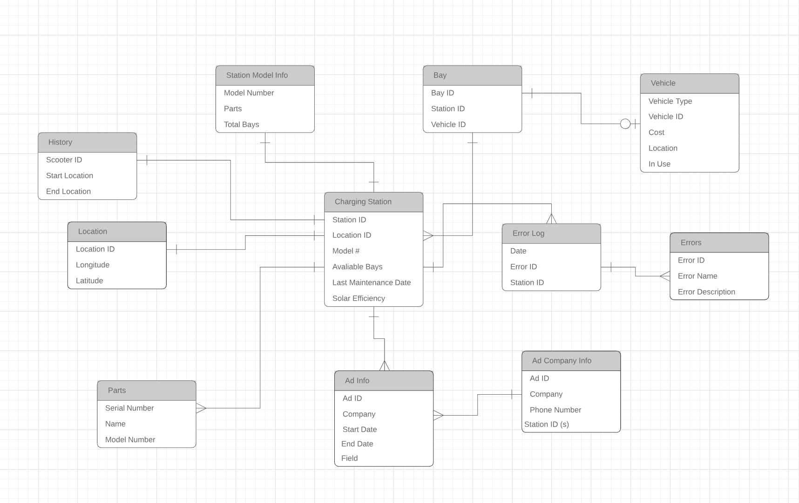

# Detailed Design Document
## Solar Scooter Project

## 2.1 – Project Description
In our project, we won't have enough connections between entities to necessitate a graph database, and the entities won't have enough attributes to necessitate a document-based database. Thus, a simple relational database will do the job.  We'll be using [PostgreSQL](https://www.postgresql.org/) because of its strong user-base, focus on strong documentation (there are 3500+ page manuals available for free), and open-source nature.

During this semester, it is likely that we will be the only ones using this database.  We'd like to build it up with data from the [Coord](https://coord.co/quickstart/sv) API so that we may track metrics related to Shared Mobility Device (MD) usage.  This data will be useful as we build an AI algorithm for selecting station incentive tiers.  This algorithm will weigh in multiple factors--such as distance, need for additional vehicles, and vehicle rate-of-change--in order to determine which stations to encourage users to leave their bike or scooter at.  Ideally, we could test this algorithm with database queries, with which many of the parameters will be filled.

In the future, if we successfully partner with Shared MD companies, the database will be able to be purged of scooter-related data.  We can shift its focus to data that is only relevant to our stations since each company maintains data for their vehicles.  But, for the purposes of this assignment, gathering vehicle data will be helpful for the algorithm mentioned above, as well as for helping us to become more familiar with common patterns in usage.

Due to cross-team dependencies, and the uncertainty of when we'll have a working product, &quot;dummy data&quot; will placehold any data that we cannot yet collect.

## 2.2 – Data Dictionary

#### Charging Station

| Station ID | Model Number | Available Bays | Last Maintenance Date | Location ID | Solar Efficiency |
| --- | --- | --- | --- | --- | --- |
| Unique ID that can be used as the primary key... might want to generate randomly for security reasons | The model of this particular station (we'll probably have 2-3 models) | The number of open bays at this station | The last date this station was maintenanced | ID connecting to the Locations table | Solar output (as a percentage) |

#### Locations

| Location ID | Longitude | Latitude |
| --- | --- | --- |
| Randomly generated unique ID | Longitude of station location | Latitude of station location |


#### Advertisement info (who the ad is from, info about ad content, dates it runs for, etc.)

| Ad ID | Company | Start date | End date | Station ID(s) |
| --- | --- | --- | --- | --- |
| Randomly generated unique ID | The company whom the ad belongs to | Day that the ad starts showing | Day that the ad ends showing | The stations which this particular ad will be displaying at |

#### Ad Company info

| Company | Phone Number | Ad ID | Station ID(s) |
| --- | --- | --- | --- |
| Company Name | Phone number/contact info for company | Randomly generated unique ID| The stations which this particular ad will be displaying at |

#### Bays

| Bay ID | Availability | Station ID |
| --- | --- | --- |
| Randomly generated unique ID | Boolean indicating whether a scooter can be placed in that bay | Unique ID of the station the bay belongs to|

#### Station Model info

| Station ID | Model Number | Parts | Total Bays |
| --- | --- | --- | --- |
| Randomly generated unique ID | Model Number | connects to Parts Table | Total Number of Bays |


#### Vehicle

| Vehicle ID | Vehicle Type | Cost | Location | In Use |
| --- | --- | --- | --- | --- |
| Randomly generated unique ID | Electric scooter, electric bike, or manual bike | Cost of the Vehicle to ride | Location of vehicle | Boolean indicating if scooter is in use |

#### Parts

| Serial Number | Part name | Model(s) | Purchase Date | Cost |
| --- | --- | --- | --- | --- |
| Can be used as primary key | Helps describe the part | The station models the part is used in | When the part was purchased | The cost of the part |

#### Error Log

| Date | Error ID | Description | Station ID |
| --- | --- | --- | ---|
| Date of Occurrence | Error ID number maps to Error Table | Description of Error | Station the error occurred at |

#### Errors

| Error ID | Error Name |
| --- | --- |
| Date of Occurrence | Type of error that occurred |

#### Ride History

| Scooter ID | Start Location | End location | Ride Duration |
| --- | --- | --- | --- |
| ID of the scooter for this entry | Ride start location | Ride end location | Ride duration |


## 2.3 – Final ERD




#### Example Queries

1. count all available bays
```*.PostgreSQL
    SELECT COUNT(bay_id)
    FROM bayavailable
    WHERE availability = True
```

2. display all available bays from station S4
```*.PostgreSQL
    SELECT bay_id
    FROM bayavailable
    WHERE station_id = ‘S4’
```

3. calculate average cost of vehicle rental
``` *.PostgreSQL
    SELECT AVG(vehicle_cost)
    FROM vehicle
```

4. select each vehicle and their cost to rent
``` *.PostgreSQL
    SELECT DISTINCT vehicle_type, vehicle_cost
    FROM vehicle
```

5. view error table
``` *.PostgreSQL
    SELECT *
    FROM error
```

6. show error log entries where error_id is E1
``` *.PostgreSQL
    SELECT *
    FROM errorlog
    WHERE error_id = ‘E1’
```

7. show each available bay for charging station S3
``` *.PostgreSQL
    SELECT chargingstation.station_id, location_id, bay_id, availability
    FROM chargingstation INNER JOIN bayavailable ON (chargingstation.station_id = bayavailable.station_id)
    WHERE chargingstation.station_id = ‘S3’;
```
