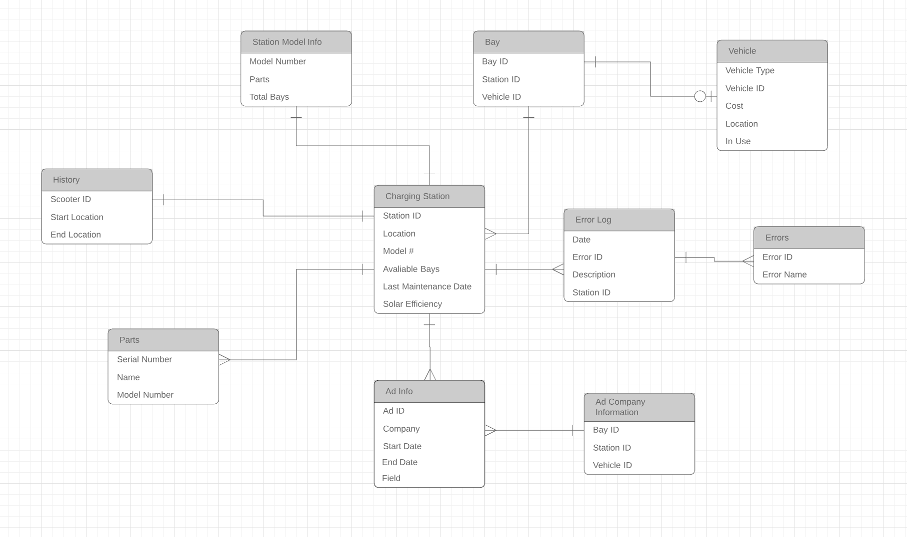

# Detailed Design Doc #
## Solar Scooter Project##

**2.1 – Project description**

**2.2 – Data Dictionary, meaning a bullet list of the final tables/columns with a complete description of each**

- Charging Station

| Station ID | Model Number | Available Bays | Last Maintenance Date | Location | Operating Solar Efficiency |
| --- | --- | --- | --- | --- |
| Unique ID that can be used as the primary key... might want to generate randomly for security reasons | The model of this particular station (we'll probably have 2-3 models) | The number of open bays at this station | The last date this station was maintenanced | The geographical long/lat of the station's location | Solar output (as a percentage) |

- Advertisement info (who the ad is from, info about ad content, dates it runs for, etc.)

| Ad ID | Company | Start date | End date | Station ID(s) |
| --- | --- | --- | --- | --- |
| Randomly generated unique ID | The company whom the ad belongs to | Day that the ad starts showing | Day that the ad ends showing | The stations which this particular ad will be displaying at |

- Bays

| Bay ID | Availability |
| --- | --- | --- |
| Randomly generated unique ID | Boolean indicating whether a scooter can be placed in that bay |

- Vehicle

| Vehicle ID | Vehicle Type | Cost | Location | In Use |
| --- | --- | --- | --- | --- |
| Randomly generated unique ID | Electric scooter, electric bike, or manual bike | Cost of the Vehicle to ride | Location of vehicle | Boolean indicating if scooter is in use |

- Parts

| Serial Number | Part name | Models | Purchase Date | Cost |
| --- | --- | --- | --- | --- | --- |
| Can be used as primary key | Helps describe the part | The station models the part is used in | When the part was purchased | The cost of the part |

- Error Log

| Date | Error ID | Description | Station ID |
| --- | --- | --- | ---|
| Date of Occurrence | Error ID number maps to Error Table | Description of Error | Station the error occurred at |

- Errors

| Error ID | Error Name |
| --- | --- |
| Date of Occurrence | Type of error that occurred |

- History

| Scooter ID | Start Location | End location | Ride Duration |
| --- | --- | --- |
| unique ID | starting location | end location after a ride |

**2.3 – Final ERD**

