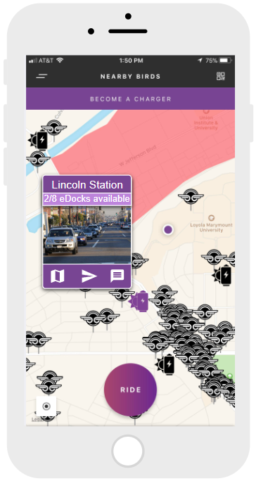
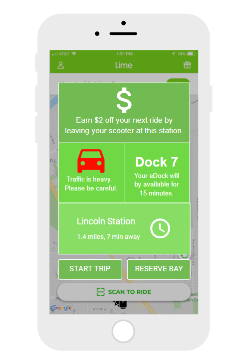

# Requirements Specifications: Solar Charging Stations Mobile Application

## 5.1  Introduction
The Solar Charger Application will be the software component of the Solar Scooter Charger project. The application will based on existing electric scooter applications, with the intention to eventually be able to collaborate and integrate with their existing applications.

The application's main page will consist of a map with the locations of the different solar chargers shown on the screen. On click, Each location will include specifics on the number of open charge slots, the number of charged scooters available (Figure 1).

## 5.2  CSCI Component Breakdown

**5.2.1** The main screen will feature a map

**5.2.2** The locations of each charge station will be shown on the map

**5.2.3** If a specific station is selected, a popup with the following information will be shown:

**5.2.4** Charge slot availability will be shown for each station

**5.2.5** Scooter availability will be shown at each station

**5.2.6** A photo of the area surrounding the station will be shown.

## 5.3  Functional Requirements by CSC

## 5.4  Performance Requirements by CSC

## 5.5  Project Environment Requirements

#### 5.5.1   Development Environment Requirements

#### 5.5.2   Execution Environment Requirements

## 5.6 Example Images
### Figure 1: Bird - Map Example

### Figure 2: Lime - UI Example

### Figure 3: Other - UI Example

