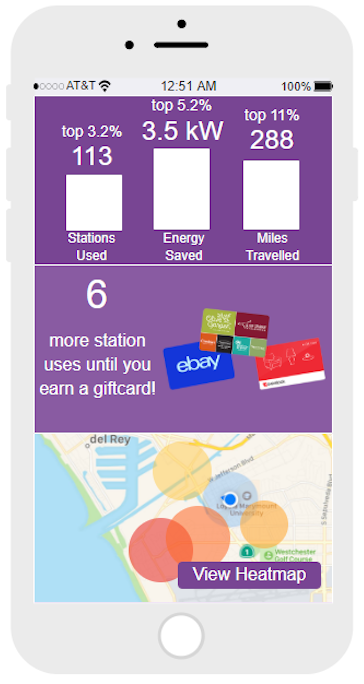

# Requirements Specifications: Solar Charging Stations Mobile Application

## 5.1  Introduction
The Solar Charger Application will be the software component of the Solar Scooter Charger project. The application will based on existing electric scooter applications, with the intention to eventually be able to collaborate and integrate with their existing applications.

The application's main page will consist of a map with the locations of the different solar chargers shown on the screen. On click, Each location will include specifics on the number of open charge slots, the number of charged scooters available (Figure 1).

## 5.2  CSCI Component Breakdown

CSCI Solar Charger Mobile Application is comprised of the following CSCs

**5.2.1** Main Page GUI

**5.2.2** Statistics Page GUI

**5.2.3** Rewards Page GUI

## 5.3  Functional Requirements by CSC

### 5.3.1 Main Page GUI

* The main page shall be displayed to the user upon opening the main application.

* The main page shall consist of a map that displays icons of solar charging stations at their specific locations.

* When a user taps a charger icon, a pop-up window shall display on the screen that displays charger information including: 1) Number of bays available 2) Ability to reserve a bay.

* A circular menu button shall be on the bottom center of the screen.

* When a user taps the button, a popup menu shall expand on the screen that displays icons and labels for other pages including: 1) Statistics 2) Rewards.

### 5.3.2 Statistics Page GUI

### 5.3.3 Rewards Page GUI

## 5.4  Performance Requirements by CSC

## 5.5  Project Environment Requirements

#### 5.5.1   Development Environment Requirements

#### 5.5.2   Execution Environment Requirements

## 5.6 Example Images
### Figure 1: Bird - Station Status Example 1

### Figure 2: Lime - Station Status Example 2

### Figure 3: Bird - Incentive Tracking

