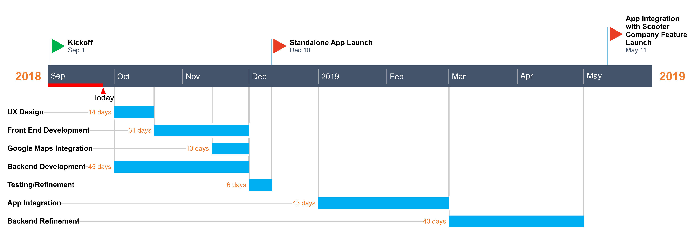

# Software Development Plan

## 4.1 Plan Introduction

This Software Development Plan provides the details of the planned development for the Electric Scooter Solar Charging Application (Name TBD), which provides a mobile interface for users to track locations of charging stations, the amount of charge per scooter, and data regarding energy saved/used.

##### Milestones

| Milestone  | Target Date | Status
| ------------- | ------------- | ------------- |
| Milestone 1  | mm/dd/yyyy  | not started |
| Milestone 2  | mm/dd/yyyy | not started |
| Milestone 3  | mm/dd/yyyy  | not started |

#### 4.1.1 Project Deliverables

## 4.2 Project Resources

### Software Team
|   Team Member    |         Department     |      Role       | Responsibilities |
| ---------------- | ---------------------- | --------------- | ---------------- |
| Ben Davis        | Computer Science       | Developer       | TBD |
| Emily Shoji      | Computer Science       | Developer       | TBD |
| Danico Pidlaoan  | Computer Science       | Developer       | TBD |

### Hardware & Business Team
|   Team Member    |         Department     |      Role       | Responsibilities|
| ---------------- | ---------------------- | --------------- | ----------------|
| Billy Walker     | Mechanical Engineering | Team Lead       | TBD |
| Masaki Takamatsu | Mechanical Engineering | Design Lead     | TBD |
| Charity Waddy    | Mechanical Engineering | Operations Lead | TBD |
| Andre DeLeon     | Mechanical Engineering |                 | TBD |
| Ahmed Kalifeh    | Mechanical Engineering |                 | TBD |
| Matt Tejada      | Entrepreneurship       | Business Lead   | TBD |

#### 4.2.1 Hardware Resources

#### 4.2.2 Software Resources

## 4.3 Project Organization

## 4.4 Project Schedule

This section provides schedule information for the Solar Charger Project.

#### 4.4.1 GANTT Chart

###### High Level Timeline

#### 4.4.2 Task / Resource Table

#### 4.4.3 Class Schedule
This section has a brief class meeting schedule and what will be covered in each class.

Date | Activities
------------ | -------------
8/29/18  | Project Ideas
9/05/18  | Project Proposal Presentations
9/12/18  | Project Proposal Presentations Con't
9/19/18  | Coding Interview Panel
9/26/18  | Intro to UML, Project Team Meetings
10/03/18 | Architectural Design, Design Reviews, Project Team Meetings
10/10/18 | Unit & Integration Test, Discussion of Deliverables, Team Meetings
10/17/18 | Guest Speaker: TBA
10/24/18 | Student Project Status Updates, Final Presentation topics, Watch "Revolution OS"
10/31/18 | Project Team Meetings & Coding - Meet in LSB
11/07/18 | Final Presentation Topics, Preliminary Design Review Presentations
11/14/18 | Student Project Status Updates, SCRUM, Project Team Meetings
11/21/18 | No Class [Thanksgiving Break]
11/28/18 | AlphaBetaCritical [ABCDR] Project Presentations
12/05/18 | Code Peer Review, Student Project Status Updates
12/12/18 | No Class [Final Exams Week]  
TBA      | Final Presentations & Demonstrations
